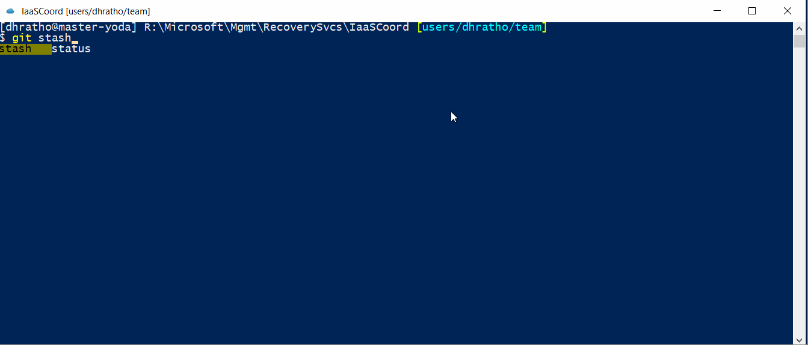
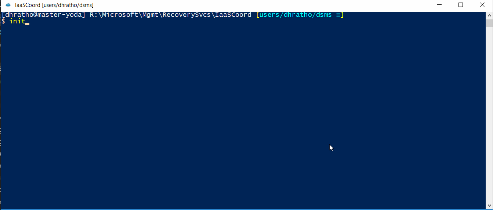

# Onebranch PS
This project is an attempt to make work on Onebranch projects fun and productive. Make no mistake, Onebranch is already productive (Git FTW!) but lack of customization with cmd takes the fun away.  
OnebranchPS tries to cover all basic features and aliases provided by Onebranch env on cmd and then adds new features to enhance the productivity. 

## Setup
- Clone this repo to your local machine.  
`git clone https://github.com/zakinkh/OneBranchPowerShell.git`
- Go to local cloned directory and run script `setup.ps1` in powershell (Preferably in non-admin mode)
- Copy shortcut `sample` (The one included in this directory with name `sample.lnk`) to your favourite location 
- Update following fields in `sample` shortcut:
    1. Target  
        Update path to init.ps1 in your OneBranch enlistment (init.ps1 is present in root of your OneBranch enlistment)
        `C:\WINDOWS\System32\WindowsPowerShell\v1.0\powershell.exe -NoExit -File %OsumOneBranchPsRoot%\OneBranch.ps1 -initScript C:\Code\Mgmt\RecoverySvcs\IaaSCoord\init.ps1`
- Rename shortcut to your convenience!
- Use file `mine.ps1` present in your local directory to add your own customizations! This file is called at the end of all script execution. 

## Features
**To see list of all available commands, visit [Commands](Commands.md)**
- Power of PowerShell to OneBranch. With PowerShell scripting any customization can be added easily.
- Bash like tab-completion for Git commands, branch name etc powered by [`posh-git`](https://github.com/dahlbyk/posh-git) and [`PS-ReadLine`](https://github.com/lzybkr/PSReadLine)

- Git status in prompt! It includes (not exhaustive list):
    - branch name
    - branch sync status with remote
    - New files in local repo
    - Modified files in local repo
    - Delete files in local repo
    - Ahead/Behind/Divergence status of branch wrt remote
- Full additional customizations with custom powershell scripts (check `mine.ps1` in installation directory after installations)

## Pro Stuff
(If you have more powerfull pro-stuff to make it more Osum, write a mail or create PR)
1. Want to customise PS prompt? 
    https://github.com/dahlbyk/posh-git/wiki/Customizing-Your-PowerShell-Prompt
2. [`PS-ReadLine`](https://github.com/lzybkr/PSReadLine) is an awesome PowerShell module which comes pre-installed with Windows 10 and Windows Server 2016. It provides various bash-like tools to powershell.  
Microsoft also provides a documentation of this [here](https://docs.microsoft.com/en-us/powershell/module/psreadline/?view=powershell-5.1).  
This tool is using `MenuComplete` from `PS-ReadLine`:  
`Set-PSReadLineKeyHandler -Key Tab -Function MenuComplete`

